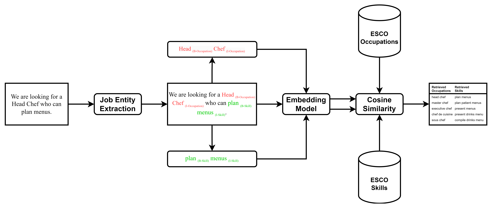

# tabiya-livelihoods-classifier
The Tabiya Livelihoods Classifier provides an easy-to-use implementation of the entity-linking paradigm to support job description heuristics.  
Using state-of-the-art transformer neural networks this tool can extract 5 entity types: Occupation, Skill, Qualification, Experience, and Domain. For the Occupations and Skills,  ESCO-related entries are retrieved.  The procedure consists of two discrete steps, entity extraction and similarity vector search.

Model's architecture:

## How to use the model
In order to use our tool please refer to [here](./inference).

## Training
The training code for this project can be found [here](./train).

## Bibiography 

A list on interesting and relevant matterial for reading:
* **GPT NER** [GPT-NER: Named Entity Recognition via Large Language Models](https://arxiv.org/pdf/2304.10428) (Shuhe Wang)
* **Skill Extraction with LLMs** [Rethinking Skill Extraction in the Job Market Domain using Large Language Models](https://arxiv.org/pdf/2402.03832) (Mike Zhang)
* **NER annotation with LLM** [LLMs Accelerate Annotation for Medical Information Extraction](https://proceedings.mlr.press/v225/goel23a)
* **Skills Entity Linking** Zhang, Mike, Rob van der Goot, and Barbara Plank. "Entity Linking in the Job Market Domain." arXiv preprint arXiv:2401.17979 (2024). 
* **Skills-ML** is an open-source Python library for developing and analyzing skills and competencies from unstructured text. (link: http://dataatwork.org/skills-ml/)   
* **SkillSpan**: Hard and Soft Skill Extraction from English Job Postings https://arxiv.org/abs/2204.12811 (Mike Zhang)
* **work2vec**: Using the full text of data from 200 million online job postings, we train and evaluate a natural language processing (NLP) model to learn the language of jobs. We analyze how jobs have changed in the past decade, and show how different words in the posting denote different occupations. We use this approach to create novel indexes of jobs, such as work-from-home ability. In ongoing work, we quantify the return to various skills. 
  
  https://digitaleconomy.stanford.edu/research/job2vec/
  https://digitaleconomy.stanford.edu/people/sarah-h-bana/
* **Data Science and ESCO** Insights into how ESCO is leveraging data-science techniques. https://esco.ec.europa.eu/en/about-esco/data-science-and-esco  
* **Machine Learning Assisted Mapping of Multilingual Occupational Data to ESCO**: A report that discusses the multilingual mapping
approach that the ESCO team established to support the maintenance of ESCO.  https://esco.ec.europa.eu/en/about-esco/publications/publication/machine-learning-assisted-mapping-multilingual-occupational
* **ESCO Publications**: Artificial intelligence & machine learning. https://esco.ec.europa.eu/en/about-esco/publications?f%5B0%5D=theme%3A109860&page=0  
